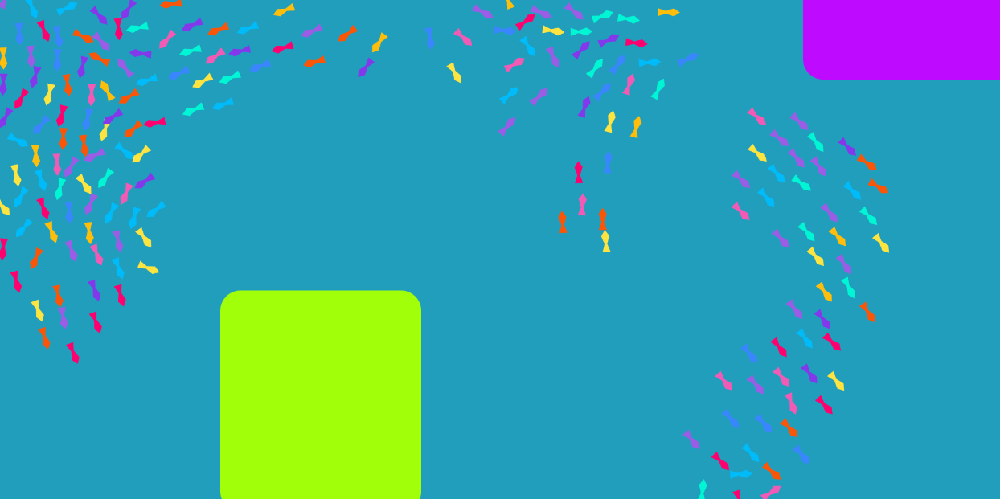

# SwarmBehavior

#### Description
Simulating fish and school of fish behavior using Boids
- fish will avoid walls and the two boxes
- converge when UP arrow is pressed (DOWN arrow to stop)
- swim to feed that is randomly placed when RIGHT arrow is pressed (LEFT to stop)

#### Artist Statement
Effect
- tried to achieve the visual swarm behavior of a school of fish
- yes I achieved the effect

#### [Playable Link](https://mperina11.github.io/SwarmBehavior/)
